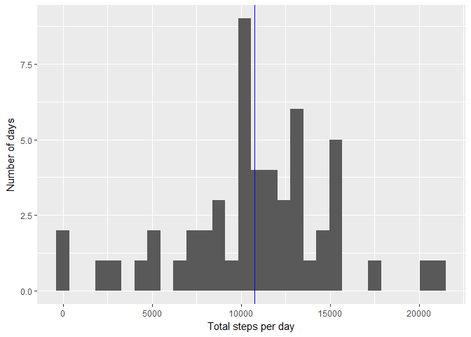
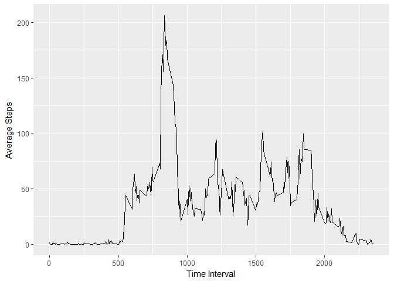
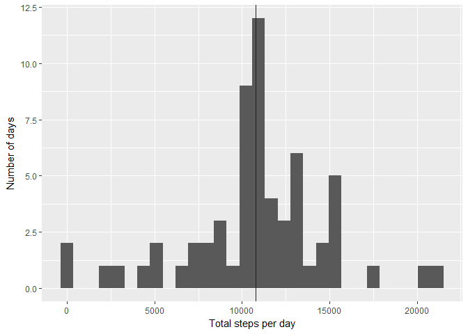

# Introduction

This assignment makes use of data from a personal activity monitoring device. This device collects data at 5 minute intervals through out the day. The data consists of two months of data from an anonymous individual collected during the months of October and November, 2012 and include the number of steps taken in 5 minute intervals each day.  

# Data File

### activity.zip

This zipped file contains a comma separated file with 3 fields:  
- **date** is the day in the 2 month period for the measurement  
- **interval** is the 5 minute interval during the day  
- **steps** is the number of steps measured in the 5 minute interval  
  
## Loading and preprocessing the data
  

```r
### Load libraries required
library(plyr)
library(ggplot2)
library(lubridate)
```

```
## 
## Attaching package: 'lubridate'
```

```
## The following object is masked from 'package:plyr':
## 
##     here
```

```
## The following object is masked from 'package:base':
## 
##     date
```

```r
### Check if file exists
if (!file.exists("activity.zip")) {
  stop("File does not exist")
}

### Unzip and read the csv file into R
activity <- read.csv(unzip("activity.zip"), header = TRUE)

### Convert the date field to date format
activity$date <- as.Date(activity$date, "%Y-%m-%d")
```
  
## What is the mean total number of steps taken per day?
  

```r
### Create a new data frame with the the total number of steps per day
dailySteps <- ddply(activity, .(date), summarise, steps = sum(steps))

### Plot a histogram with a green vertical line for the mean and a blue vertical
### line for the median

qplot(steps, data = dailySteps, xlab = "Total steps per day", ylab = "Number of days")  + geom_vline(data = dailySteps, xintercept = mean(dailySteps$steps, na.rm = TRUE), col = "green") + geom_vline(data = dailySteps, xintercept = median(dailySteps$steps, na.rm = TRUE), col = "blue")
```

```
## `stat_bin()` using `bins = 30`. Pick better value with `binwidth`.
```

```
## Warning: Removed 8 rows containing non-finite values (stat_bin).
```

<!-- -->
  
## What is the average daily activity pattern?
  
Make a time series plot (i.e. type = "l") of the 5-minute interval (x-axis)
and the average number of steps taken, averaged across all days (y-axis)
  

```r
### Create a new data frame with the average number of steps for each 5-minute
### interval, across all days for each interval
averageSteps <- ddply(activity, .(interval), summarise, 
                      average = mean(steps, na.rm = TRUE))

### Create a time series plot
qplot(interval, average, data = averageSteps, geom = "line", 
      xlab = "Time Interval", ylab = "Average Steps")
```

<!-- -->
  
Which 5-minute interval, on average across all the days in the dataset, 
contains the maximum number of steps?
  

```r
### Find the interval with the maximum number of steps
maxInterval <- averageSteps[averageSteps$average == max(averageSteps$average), 1]
print(maxInterval)
```

```
## [1] 835
```
  
The interval with the maximum number of steps is 835.
  
## Imputing missing values
  
Replace missing values with the average for that interval over all the days
  

```r
### Calculate and report the total number of missing values in the dataset
### (i.e. the total number of rows with NAs)
missing <- nrow(activity[is.na(activity$steps), ])
print(missing)
```

```
## [1] 2304
```

```r
### Fill in the missing values by using the mean for that interval
### First re-calculate the average steps for each interval over all the days
averageSteps <- ddply(activity, .(interval), summarise, 
                      average = mean(steps, na.rm = TRUE))

## Create a new data frame
activityNoNA <- activity

## Replace NAs in the data frame with the average steps for that interval
for (i in 1:nrow(activityNoNA)) {
  if (is.na(activityNoNA$steps[i])) {
    activityNoNA$steps[i] <- averageSteps[averageSteps$interval == activityNoNA$interval[i], 2]
  }
  
}
```
  
Explore whether there is an impact from missing values
  

```r
### Create a new data frame with the the total number of steps per day
dailyStepsNoNA <- ddply(activityNoNA, .(date), summarise, steps = sum(steps))

### Plot a histogram with a green vertical line for the mean and a blue vertical
### line for the median
qplot(steps, data = dailyStepsNoNA) + geom_vline(data = dailyStepsNoNA, xintercept = mean(dailyStepsNoNA$steps, na.rm = TRUE), col = "green") + geom_vline(data = dailyStepsNoNA, xintercept = median(dailyStepsNoNA$steps, na.rm = TRUE), col = "blue")
```

```
## `stat_bin()` using `bins = 30`. Pick better value with `binwidth`.
```

<!-- -->

```r
### Compare the mean and median daily steps before and after removing NAs
meanDiff <- mean(dailyStepsNoNA$steps, na.rm = TRUE) - mean(dailySteps$steps, na.rm = TRUE)
print(meanDiff)
```

```
## [1] 0
```

```r
medianDiff <- median(dailyStepsNoNA$steps, na.rm = TRUE) - median(dailySteps$steps, na.rm = TRUE)
print(medianDiff)
```

```
## [1] 1.188679
```
  
The difference in the means, before and after removing missing values, is 0 and the difference in medians is 1.1886792.

## Are there differences in activity patterns between weekdays and weekends?
  

```r
### Create a new factor variable in the dataset with two levels
### - "weekday" and "weekend" indicating whether a given date is a weekday or
### weekend day
activityNoNA$period <- factor(c("weekday", "weekend"))

for (i in 1:nrow(activityNoNA)) {
  if (wday(activityNoNA$date[i]) == 7) {
    activityNoNA$period[i] <- "weekend"
  } else if (wday(activityNoNA$date[i]) == 1) {
    activityNoNA$period[i] <- "weekend"
  } else {
    activityNoNA$period[i] <- "weekday"
  }
}

activityNoNA$period <- as.factor(activityNoNA$period)

### Make a panel plot containing a time series plot (i.e. type = "l") of the 
### 5-minute interval (x-axis) and the average number of steps taken, averaged 
### across all weekday days or weekend days (y-axis)

### First summarise the data
averageStepsNoNA <- ddply(activityNoNA, .(period, interval), summarise, 
                      average = mean(steps))

### Set the plot parameters to be 2 rows by 1 column
par(mfrow = c(2,1))

### Create the plot using 2 facets
qplot(interval, average, data = averageStepsNoNA, facets = period~., 
      geom = "line", xlab = "Interval", ylab = "Number of steps")
```

<!-- -->
